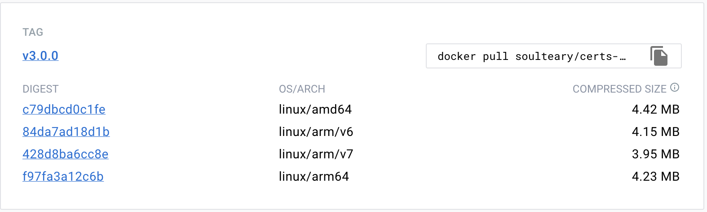

# Certs Maker

Small self-signed tool, ~ 3MB Size.

Generate a self-hosted /dev certificate through configuration.





## Support Variables

You can customize the generated certificate by declaring the environment variables of docker.

- **Country Name**: `CERT_C`
  - eg: `CERT_C=CN`
- **State Or Province Name**: `CERT_ST`
  - eg: `CERT_ST=BJ`
- **Locality Name**: `CERT_L`
  - eg: `CERT_L=HD`
- **Organization Name**: `CERT_O`
  - eg: `CERT_O=Lab`
- **Organizational Unit Name**: `CERT_OU`
  - eg: `CERT_OU=Dev`
- **Common Name**: `CERT_CN`
  - eg: `CERT_CN=Hello World`
- **Domians**: `CERT_DNS`
  - eg: `CERT_DNS=lab.com;*.lab.com;*.data.lab.com`

## Usage

Use `Docker`:

```bash
docker run --rm -it -e parameter=... -v `pwd`/certs:/ssl soulteary/certs-maker
```

Or use `docker-compose`:

```yaml
version: '2'

services:

  certs-maker:
    image: soulteary/certs-maker
    environment:
      - CERT_DNS=a.com;b.com;c.com;*.d.com;
    volumes:
      - ./certs:/ssl
```

## Example

Single domain name:

```bash
# docker run --rm -it -e CERT_DNS=domain.com -v `pwd`/certs:/ssl soulteary/certs-maker

User Input: { CERT_DNS: 'domain.com' }
Generating a RSA private key
..............................................................+++++
.......+++++
writing new private key to 'ssl/domain.com.key'
-----

# ls certs
domain.com.conf domain.com.crt  domain.com.key
```

Wildcard domain name:

```bash
Single domain:

```bash
# docker run --rm -it -e CERT_DNS="*.domain.com" -v `pwd`/certs:/ssl soulteary/certs-maker
# or
# docker run --rm -it -e CERT_DNS=\*.domain.com -v `pwd`/certs:/ssl soulteary/certs-maker

User Input: { CERT_DNS: '*.domain.com' }
Generating a RSA private key
..................+++++
.......................................................+++++
writing new private key to 'ssl/*.domain.com.key'
-----

# ls certs
*.domain.com.conf *.domain.com.crt  *.domain.com.key
```

Multiple domain names:

```bash
Single domain:

```bash
# docker run --rm -it -e CERT_DNS="a.com;*.domain.com;a.c.com" -v `pwd`/certs:/ssl soulteary/certs-maker
# or
# docker run --rm -it -e CERT_DNS=a.com\;\*.domain.com\;a.c.com -v `pwd`/certs:/ssl soulteary/certs-maker

User Input: { CERT_DNS: 'a.com;*.domain.com;a.c.com' }
Generating a RSA private key
...+++++
................................................................................................................................................+++++
writing new private key to 'ssl/a.com.key'
-----

# ls certs
a.com.conf a.com.crt  a.com.key
```

## Docker Image

[soulteary/certs-maker](https://hub.docker.com/r/soulteary/certs-maker)
## LICENSE

[MIT](https://github.com/soulteary/certs-maker/blob/master/LICENSE)
