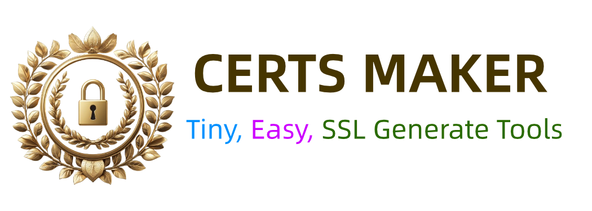

# Certs Maker

[](https://github.com/soulteary/certs-maker/actions/workflows/github-code-scanning/codeql) [](https://github.com/soulteary/certs-maker/actions/workflows/release.yaml) [](https://hub.docker.com/r/soulteary/certs-maker) [](https://codecov.io/gh/soulteary/certs-maker)

<p style="text-align: center;">
  <a href="README.md" target="_blank">ENGLISH</a> | <a href="README_CN.md">中文文档</a>
</p>



**Lightweight self-signed certificate generator, size between 1.5MB (executable) and 5MB (docker image).**

Generate self-hosted or development certificates through simple configuration.


## Quick Start

Create self-signed certificates supporting `*.lab.com` and `*.data.lab.com` domains with just **"One Click"**:

```bash
docker run --rm -it -v `pwd`/ssl:/ssl soulteary/certs-maker:v3.7.0 "--CERT_DNS=lab.com,*.lab.com,*.data.lab.com"
# OR use environment:
# docker run --rm -it -v `pwd`/ssl:/ssl -e "CERT_DNS=lab.com,*.lab.com,*.data.lab.com" soulteary/certs-maker:v3.7.0
```

The generated certificates will be stored in the `ssl` directory within the execution directory:

```bash
ssl
├── lab.com.conf
├── lab.com.der.crt
├── lab.com.der.key
├── lab.com.pem.crt
└── lab.com.pem.key
```

You can use PEM or DER format certificates according to your preference.

For those who prefer file-based configuration, you can use a `docker-compose.yml` file like this:

```yaml
version: '2'
services:

certs-maker:
    image: soulteary/certs-maker:v3.7.0
    environment:
      - CERT_DNS=lab.com,*.lab.com,*.data.lab.com
    volumes:
      - ./ssl:/ssl
```

Then, run the following command:

```bash
docker-compose up
# OR
# docker compose up
```

To make the certificate more Kubernetes-friendly, add the `FOR_K8S` parameter:

```bash
docker run --rm -it -v `pwd`/ssl:/ssl soulteary/certs-maker:v3.7.0 "--CERT_DNS=lab.com,*.lab.com,*.data.lab.com --FOR_K8S=ON"
# OR
# docker run --rm -it -v `pwd`/ssl:/ssl -e "CERT_DNS=lab.com,*.lab.com,*.data.lab.com" -e "FOR_K8S=ON" soulteary/certs-maker:v3.7.0
```

Here's a K8s-friendly `docker-compose.yml` file:

```yaml
version: '2'
services:

certs-maker:
    image: soulteary/certs-maker:v3.7.0
    environment:
      - CERT_DNS=lab.com,*.lab.com,*.data.lab.com
      - FOR_K8S=ON
    volumes:
      - ./ssl:/ssl
```

To enhance compatibility with Firefox, include the `FOR_FIREFOX` parameter:

```bash
docker run --rm -it -v `pwd`/ssl:/ssl soulteary/certs-maker:v3.7.0 "--CERT_DNS=lab.com,*.lab.com,*.data.lab.com --FOR_FIREFOX=ON"
# OR
# docker run --rm -it -v `pwd`/ssl:/ssl -e "CERT_DNS=lab.com,*.lab.com,*.data.lab.com" -e "FOR_FIREFOX=ON" soulteary/certs-maker:v3.7.0
```

And here's a Firefox-friendly `docker-compose.yml` file:

```yaml
version: '2'
services:

certs-maker:
    image: soulteary/certs-maker:v3.7.0
    environment:
      - CERT_DNS=lab.com,*.lab.com,*.data.lab.com
      - FOR_FIREFOX=ON
    volumes:
      - ./ssl:/ssl
```

For more granular control over certificate details, such as issuing country, province, street, and organization name, refer to the following section on manually adding parameters.

## SSL Certificate Parameters

Customize your generated certificate by setting environment variables or using Docker CLI arguments.

Using environment variables:

| Parameter | Name | Use in environment variables |
| ------ | ------ | ------ |
| Country Name | CERT_C | `CERT_C=CN` |
| State Or Province Name | CERT_ST | `CERT_ST=BJ` |
| Locality Name | CERT_L | `CERT_L=HD` |
| Organization Name | CERT_O | `CERT_O=Lab` |
| Organizational Unit Name | CERT_OU | `CERT_OU=Dev` |
| Common Name | CERT_CN | `CERT_CN=Hello World` |
| Domains | CERT_DNS | `CERT_DNS=lab.com,*.lab.com,*.data.lab.com` |
| Issue for K8s | FOR_K8S | `FOR_K8S=ON` |
| Issue for Firefox | FOR_FIREFOX | `FOR_FIREFOX=ON` |
| File Owner User | USER | `USER=ubuntu` |
| File Owner UID | UID | `UID=1234` |
| File Owner GID | GID | `GID=2345` |
| Custom certs output dir | DIR | `DIR=./ssl` |
| Custom certs filename | CUSTOM_FILE_NAME | `CUSTOM_FILE_NAME=filename` |
| Expire Days | EXPIRE_DAYS | `EXPIRE_DAYS=3650` |

Using program CLI arguments:

| Parameter | Name | Use in CLI arguments |
| ------ | ------ | ------ |
| Country Name | CERT_C | `--CERT_C=CN` |
| State Or Province Name | CERT_ST | `--CERT_ST=BJ` |
| Locality Name | CERT_L | `--CERT_L=HD` |
| Organization Name | CERT_O | `--CERT_O=Lab` |
| Organizational Unit Name | CERT_OU | `--CERT_OU=Dev` |
| Common Name | CERT_CN | `--CERT_CN=Hello World` |
| Domains | CERT_DNS | `--CERT_DNS=lab.com,*.lab.com,*.data.lab.com` |
| Issue for K8s | FOR_K8S | `--FOR_K8S=ON` |
| Issue for Firefox | FOR_FIREFOX | `--FOR_FIREFOX=ON` |
| File Owner User | USER | `--USER=ubuntu` |
| File Owner UID | UID | `--UID=1234` |
| File Owner GID | GID | `--GID=2345` |
| Custom certs output dir | DIR | `--DIR=./ssl` |
| Custom certs filename | CUSTOM_FILE_NAME | `--CUSTOM_FILE_NAME=filename` |
| Expire Days | EXPIRE_DAYS | `--EXPIRE_DAYS=3650` |

## Docker Image

[soulteary/certs-maker](https://hub.docker.com/r/soulteary/certs-maker)

## Related Documentation and Tutorials

- [Creating a Lightweight 3MB Docker Image for Self-Signed Certificates: Introducing Certs Maker](https://soulteary.com/2022/10/22/make-docker-tools-image-with-only-3md-self-signed-certificate-certs-maker.html)
- [A Comprehensive Guide to Creating and Implementing Self-Signed Certificates](https://soulteary.com/2021/02/06/how-to-make-and-use-a-self-signed-certificate.html)
